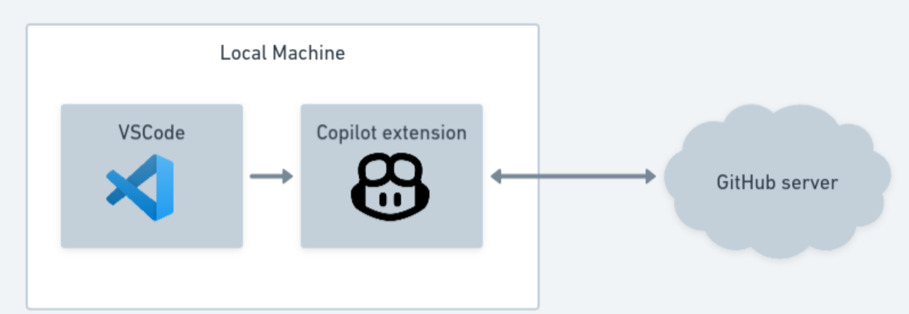
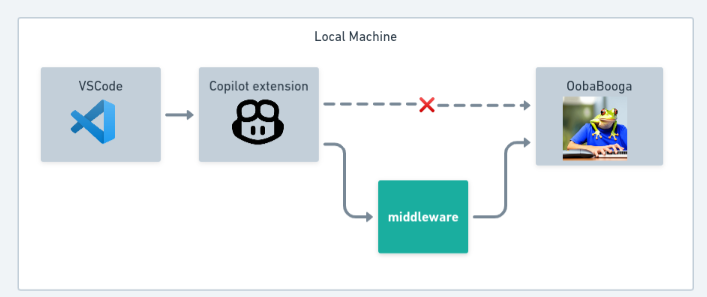

# PrivateGitHubCopilot

<a href="https://sahem.ksrelief.org/Pages/ProgramDetails/1ca8852b-9e6d-ee11-b83f-005056ac5498">

</a>

[donate here](https://sahem.ksrelief.org/Pages/ProgramDetails/1ca8852b-9e6d-ee11-b83f-005056ac5498)


  
<!-- ([image source](https://marketplace.visualstudio.com/items?itemName=GitHub.copilot)) -->

This project allows you to host your own GitHubCopilot-like model locally while using the official GitHubCopilot VSCode extension.

## Installation:

1. Download and install the **[oobabooga](https://github.com/oobabooga/text-generation-webui#installation)** backend

2. **Download a model**

    open the oobabooga UI, go to the **models** tab and download a code completion model. I'm using: `Deci/DeciCoder-1b`, paste that name, then click download, then click load once complete

    **Which model should I choose?**
    Use smaller models for faster predictions, especially if you have a weaker PC.
    I tested DeciCoder-1b

    |size|speed|model name|
    |-|-|-|
    |125M|superfast|flax-community/gpt-neo-125M-code-clippy-dedup-2048|
    |1B|fast|Deci/DeciCoder-1b|
    |3B|medium|TheBloke/stablecode-instruct-alpha-3b-GGML|
    |7B|slow|mlabonne/codellama-2-7b|
    |15B|slow|TheBloke/WizardCoder-15B-1.0-GGML|

    

# 
<details>
<summary>Optional testing</summary>

A. (optional) Test the backend using `curl`:

    ```sh
    curl -X 'POST'   'http://localhost:5001/v1/engines/codegen/completions'   -H 'accept: application/json'   -H 'Content-Type: application/json'   -d '{"prompt":"def hello_w","suffix":"","max_tokens":500,"temperature":0.4,"top_p":1,"n":10,"stop":["\ndef ","\nclass ","\nif ","\n\n#"],"logprobs":2,"stream":true}'
    ```

B. (optional) Test that the model is working by going to the "chat" tab and clicking "generate".
    

</details>

3. Go to VSCode and modify the settings and add the following:

    ```json
    "github.copilot.advanced": {
        "debug.overrideEngine": "codegen",
        "debug.testOverrideProxyUrl": "http://localhost:8000", // address:port of middleware
        "debug.overrideProxyUrl": "http://localhost:8000",
    },
    ```

4. (optional for authentication) Update `~/.vscode/extensions/github.copilot-*/dist/extension.js` with the following:
    - Replace `https://api.github.com/copilot_internal` with `http://127.0.0.1:8000/copilot_internal`
    - replace `https://copilot-proxy.githubusercontent.com` with `http://127.0.0.1:8000`

5. Run the proxy:

    ```sh
    pip install git+https://github.com/FarisHijazi/PrivateGitHubCopilot
    PrivateGitHubCopilot --port 7000
    ```


    If you have oobabooga running on a separate server use the --backend argument {hostname:port}
    ```sh
    pip install git+https://github.com/FarisHijazi/PrivateGitHubCopilot
    PrivateGitHubCopilot --port 8000 --backend http://10.0.0.1:5002
    ```

<details>
    <summary>(Optional): testing the middleware</summary>

```sh
curl -X 'POST'   'http://localhost:8000/v1/engines/codegen/completions'   -H 'accept: application/json'   -H 'Content-Type: application/json'   -d '{"prompt":"def hello_w","suffix":"","max_tokens":500,"temperature":0.4,"top_p":1,"n":2,"stop":["\ndef ","\nclass ","\nif ","\n\n#"],"logprobs":2,"stream":true}'
```

expected output

```sh
data: {"id": "conv-1692741316942825472", "object": "text_completion.chunk", "created": 1692741316, "model": "Deci_DeciCoder-1b", "choices": [{"index": 0, "finish_reason": "stop", "text": "", "logprobs": {"top_logprobs": [{"<|endoftext|>": -0.4215908944606781, "<fim_middle>": -1.2965909242630005, "\n": -3.0741329193115234}]}}], "usage": {"prompt_tokens": 4, "completion_tokens": 13, "total_tokens": 17}}

data: [DONE]
```

</details>

6. install the [official GitHub copilot extension](https://marketplace.visualstudio.com/items?itemName=GitHub.copilot)

7. HAPPY CODING!

    To test that the copilot extension is working, either type some code and hope for a completion
    or use the command pallet (`Ctrl+Shift+P`) and search for `GitHub Copilot: Open Completions Panel`

---

## How this works

This is done using a single script: `PrivateGitHubCopilot/middleware.py` (only 90 lines of code), which is a compatibility layer between the official GitHub copilot VSCode extension and [oobabooga](https://github.com/oobabooga/text-generation-webui) as a backend.

Credit: I learned about the traffic redirecting from the Fauxpilot project [here](https://github.com/fauxpilot/fauxpilot/blob/main/documentation/client.md#copilot-plugin).

| | |
|:-------:|:-------:|
|Cloud|  |
|Self-hosted|   |


<details>
  <summary>Advanced experimental hacks</summary>

The tokenizers used by Copilot are not the same, so you can overwrite them. However, I'm not sure how useful this actually is as I don't notice any change in performance

```sh
COPILOTPATH=$HOME/.vscode/extensions/github.copilot-1.105.353
MODELPATH=$HOME/Projects/oobabooga_linux/text-generation-webui/models/Deci_DeciCoder-1b

mv $COPILOTPATH/dist/resources $COPILOTPATH/dist/resources.backup
mkdir -p $COPILOTPATH/dist/resources/cushman001
mkdir -p $COPILOTPATH/dist/resources/cushman002

cp $MODELPATH/tokenizer.json $COPILOTPATH/dist/resources/cushman001/tokenizer_cushman001.json
cp $MODELPATH/merges.txt     $COPILOTPATH/dist/resources/cushman001/vocab_cushman001.bpe

cp $MODELPATH/tokenizer.json $COPILOTPATH/dist/resources/cushman002/tokenizer_cushman002.json
cp $MODELPATH/merges.txt     $COPILOTPATH/dist/resources/cushman002/vocab_cushman002.bpe

```

And to revert your changes, just uninstall and reinstall the extension.

OR:

```sh
rm -rf $COPILOTPATH/dist/resources
mv $COPILOTPATH/dist/resources.backup $COPILOTPATH/dist/resources
```

</details>

## 😁 Benefits of self-hosting

1. 🔏 **Privacy**: No more sending your code to the cloud! This is the main benefit especially for enterprise. No code is sent to the cloud when self-hosting since everything runs on your machine(s).
2. 🌐 **Works without internet**: use it on the plane! ✈️
3. 💰 **Free**: No need to pay for your monthly subscription


## 😞 Limitations

1. GitHub copilot looks at multiple files for context. The current hack only looks at the current file
2. **Quality** Open source models might not have suggestions as good as copilot, but still as good *most* of the time
3. GitHub copilot gives 10 suggestions, while this hack gives only 1 suggestion per completion
4. 🐛 There's a bug where the first space in autocompletion is skipped, this is due to the oobabooga backend, not the model


## Why is this project setup this way?

There are many other projects for having an open source alternative for copilot, but they all need so much maintenance, I tried to use an existing large project that is well maintained: [oobabooga](https://github.com/oobabooga/text-generation-webui), since it supports almost all open source LLMs and is commonly used, and is well maintained

I know that the middleware method might not be optimal, but this is a minimal hack that's easy to run, and this repository should be really easy to maintain.

Once oobabooga supports multiple requests in a single call, then the middleware should no longer be needed.


## Other works

Here are some helpful open source projects I found while doing my research:

|Project URL|description|actively maintained (as of Aug 2023)|
|-|-|-|
| https://github.com/CodedotAl/gpt-code-clippy | Frontend + models |❌|
| https://github.com/Venthe/vscode-fauxpilot | this is a FauxPilot frontend |✅|
| https://github.com/hieunc229/copilot-clone | frontend which uses Google/StackOverflow search as a backend |✅|
| https://github.com/fauxpilot/fauxpilot | FauxPilot backend |✅|
| https://github.com/ravenscroftj/turbopilot | A backend that runs models |✅|

